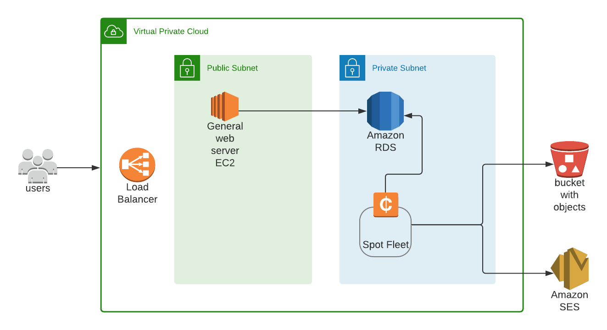

# MonthlyWrapped Project Overview

Web application that mimicks the Spotify yearly [Wrapped](https://artists.spotify.com/blog/your-2020-wrapped-is-here) feature. Spotify Wrapped is a 

>  personalized summary of your year on Spotify that will tell you how your music connected with fans around the world.

With **MonthlyWrapped**, any user can get a personalized summary of their listening habits for every month in the form of an image. Check the app out here! 

### Architecture overview

# The challenging part

(43,000 users) *  `2s` = `23.8  hrs`

At the end of every month, this project must generate 2 images for every user. At roughly 43,000 users, with an average of `2s` to create an image, the entire time to process all images for all users takes longer than `24 hr`. Not considering any scaling or optimizations, including any new users after the initial 43,000 users would require the app to start processing 2 days before the end of the month. This is not ideal as those users then lose a day of statistics based on their listening history.

### Solutions:

1. **Spot instance Fleet:** The idea here is to scale horizontally. So instead of running a single EC2 instance for 24 hrs to produce all the images, the application will distribute all the tasks between N number of instances. Vertical scaling could be used also be used here as a beefier instance type would be better for intensive processes like image processing.
2. **Concurrent lambda functions:** For each user spawn a lambda function to perform the image processing
3. **Faster language:** On top of horizontally scaling with a strong instance type and vertical scaling with more instances it might be worthwhile to move the image-generation service from Python to a language like C to improve speed.
4. 

# S3 overview:

### Task:

Store 2 personalized images for every user at the end of every month

Use [S3 prefix](https://docs.aws.amazon.com/AmazonS3/latest/userguide/using-prefixes.html) to organize data by user such as the following  `<user_uuid>/songs/<year> `

- Example `/user_123/songs/2021/...`
- Example `/user_123/artists/2021/...`

### S3 costs

**Difference between request and data transfer**

> If you include an image on a page, and the image is in S3, every time the page is viewed, you're billed for the request and the transfer, unless the browser has cached the image.
>
> https://stackoverflow.com/questions/33132987/difference-between-data-transfer-and-get-request-for-amazon-s3

| Users after 12 months | Storage | Storage cost         | Requests cost | GB Transfer out per month cost | Total      |
| --------------------- | ------- | -------------------- | ------------- | ------------------------------ | ---------- |
| 10,000 users          | 144 gb  | **$3.31 per month**  | **0.108**     | **12 gb = $12.87**             | **$4.84**  |
| 50,000 users          | 720 gb  | **$16.56 per month** | **.54**       | **60 gb = $5.31**              | **$22.41** |
| 100,000 users         | 1.44 tb | **$33.91 per month** | **$ 1.04**    | **120 gb = $10.71**            | **$45.70** |

**1 month data transfer out cost**

**(num users) * (2 photos * 600 kb (avg size per image))**

(10,000 users) * (1200 kb ) = 12 gb

(50,000 users) * (1200 kb ) = 60 gb

(100,000 users) * (1200 kb ) = 120 gb

*NOTE* CloudFront is slightly cheaper as it negates the transfer charge

**1 year average storage useage per user**

Average image size is `600 kb`

(24 images total) * `600kb` = `14.4 mb`

10,000 * 14.4 mb = `144 gb` per month

50,000 * 14.4 mb = `720 gb`

100,000 * 14.4 mb =  `1.44 tb`

**How to optimize:**

- Remove the feature where users can log in and see all their past stories.
- Given that they will receive an email for every monthly story, this could act as their archive. By not offering a UI to all past stories we can remove s3 entirely or we will only need it to store the current months images. This reduces storage costs significantly which make up the bulk of the costs.

# RDS overview

There are two use cases that require a database for this project

1. There needs to be a relationship between every user that signs up for this app and their designated space in S3 to store their data
   - This is simply achieved with a user_id in RDS, `uuid` in this case. Upon registering, a user is given an id and a unique space in S3 is created based on this uuid
2. We need to persist an access token from Spotify and an email for every user
   - At the end of the month, an <u>image-generation</u> service will iterate through every user in the database, make a request to the Spotify API with their **access token**, create an image and store it in S3 base of their **user id**, and finally send an **email** to every user

# Going Forward

The two main tasks that will determine the best AWS configuration are the following:

1. Determine which EC2 instance type is most appropriate for my *general* API that handles things such as Sign Up, Login, and fetching data from S3
2. Determine which EC2 instance type is best for my **image-generation** service. The image-generation service will be more memory bound and cpu bound.

